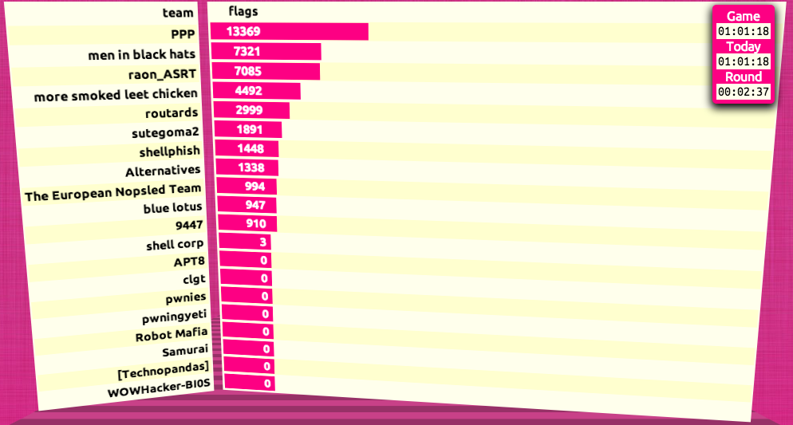

Hello!

We're absolutely and completely thrilled at the response to our game this year!
As we said during the closing ceremonies, we're honored and proud that you all
competed with us, and would like once again to thank:

* Dark Tangent and the other DEF CON organizers, for supporting our plans to host.
* The DEF CON Goons, for helping make the contest in Vegas a fun and enjoyable
  venue.
* The twenty teams that competed in finals, for running a friendly, honorable, 
  and skillful game. You all did a great job, no matter where you ended up on 
  the scoreboard.
* The 898 teams that competed in the qualifying game in June, for your 
  spectacular show of skill in solving our challenges over 2400 times.
* And finally, we'd like to thank our friends, families, and significant others,
  for forgiving our long nights and exhausting weekends over the last several 
  months.

While we did get a small chance to explain the game on Sunday night, we'd like
to share a more detailed and thoughtful set of results.

# Zero Sum

The finals game this year was zero-sum: the game started with 50,000 flags,
allocated 2500 per team. It ended with 50,000 flags, although less evenly 
distributed.

aside:
What about the missing 7830 flags? They were with the twenty-first team,
Legitimate Business Syndicate. Read on for why!

What this meant for the game flow was a terrible calculus for leading teams. 
Teams with no flags will obviously not be very lucrative targets. Teams with
large stockpiles of flags were also more likely to turn any exploit launched at 
them around as a new attack, devaluing the exploit.

# One Hour Left

Witn an hour left in the game Sunday afternoon, we had PPP at the top of the 
leaderboard, followed by "men in black hats" and "raon_ASRT," who had finished
Saturday with shockingly close scores. The black-hatted gentlemen were leading 
by fewer 240 flags, which meant that the Korean team would be able to mount a 
comeback for the win.

# Two Mistakes

We made a few mistakes and misjudgements during the game, from network settings
causing a few captured tokens to expire without capture, to scoring logic errors
that left Legitimate Business Syndicate with more flags than all but PPP, we
have a few things to fix next year. The two mentioned mistakes have an impact
on game scoring.

The misconfigured network caused teams to be incorrectly throttled in their 
connections to the REST API that redeemed tokens for flag captures. This meant
that some teams weren't able to redeem captured tokens due to the busy and 
hostile network environment. 

We have reprocessed those expired tokens based on logs and scorebot data, and 
that they disproportionately and unfairly affected individual teams unevenly. 
They are included in the complete and final results below.

The scoring logic error that left remainder flags in our possession affected
all teams equally; while this may have resulted in different scores, we believe
that not only did it affect all teams equally and fairly, we also hold that
changing this would invalidate many teams' actions during the game. All twenty
competing teams played the game as implemented, not the game we wish we did
after the fact.

We will not factor the flags that fell on the floor into the final results 
below.

# Four Observations

1. Each token was worth nineteen points, split between every team that
   redeemed it. Fourteen teams figured out that if they redeemed their
   own tokens, they'd deprive other teams of valuable flags.
2. Non-virtualized team hardware removed most of our concerns about CPU
   starvation due to malicious action. The remaining concerns were based
   on cooling capacity and reduction thereof when the lid was off the box
   holding team hardware.
3. 
4.

# Final Results

1. PPP, 13369 flags
2. men in black hats, 7321 flags
3. raon_ASRT, 7085 flags